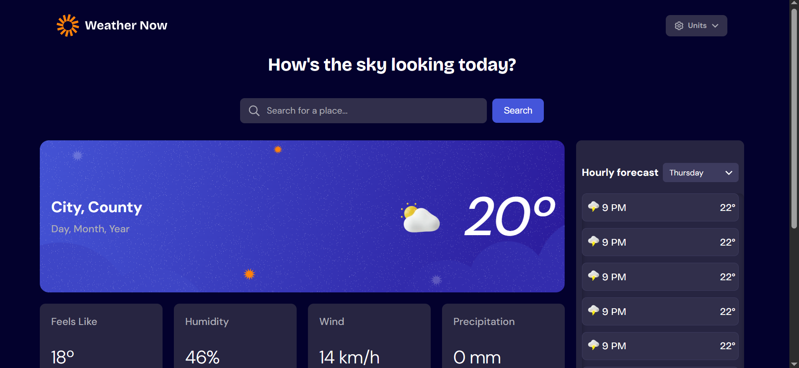

# Frontend Mentor - Weather App Solution

This is a solution to the [Weather app challenge on Frontend Mentor](https://www.frontendmentor.io/challenges/weather-app-K1FhddVm49). Frontend Mentor challenges help you improve your coding skills by building realistic projects. 

## Table of contents

- [Overview](#overview)
  - [The challenge](#the-challenge)
  - [Screenshot](#screenshot)
  - [Links](#links)
- [My process](#my-process)
  - [Built with](#built-with)
  - [What I learned](#what-i-learned)
  - [Continued development](#continued-development)
  - [Useful resources](#useful-resources)
- [Author](#author)
- [Acknowledgments](#acknowledgments)

## Overview

### The challenge

Users should be able to:

- Search for weather information by entering a location in the search bar
- View current weather conditions including temperature, weather icon, and location details
- See additional weather metrics like "feels like" temperature, humidity percentage, wind speed, and precipitation amounts
- Browse a 7-day weather forecast with daily high/low temperatures and weather icons
- View an hourly forecast showing temperature changes throughout the day
- Switch between different days of the week using the day selector in the hourly forecast section
- Toggle between Imperial and Metric measurement units via the units dropdown 
- Switch between specific temperature units (Celsius and Fahrenheit) and measurement units for wind speed (km/h and mph) and precipitation (millimeters) via the units dropdown
- View the optimal layout for the interface depending on their device's screen size
- See hover and focus states for all interactive elements on the page

### Screenshot



### Links

- Solution URL: [https://github.com/seuusuario/weather-app](https://github.com/seuusuario/weather-app)
- Live Site URL: [https://seuprojeto.netlify.app](https://seuprojeto.netlify.app)

## My process

### Built with

- HTML5
- CSS3 (Flexbox, Grid, custom properties)
- JavaScript (ES6+)
- Fetch API for weather and geocoding
- Responsive, mobile-first design

### What I learned

- How to fetch data from an external API (Open-Meteo) and handle errors gracefully
- Manipulating the DOM to dynamically update weather data
- Creating a fully responsive layout using CSS Grid and Flexbox
- Handling user input, search suggestions, and click events
- Implementing unit conversion (Celsius ↔ Fahrenheit, km/h ↔ mph, mm ↔ in)
- Managing state (current city, units, selected day) in a JS project without frameworks

Example of updating the UI dynamically:

```js
hourlyList.innerHTML = '';
data.hourly.time.forEach((time, i) => {
  const date = new Date(time);
  if (date.toDateString() === selectedDate.toDateString()) {
    const card = document.createElement('div');
    card.className = 'hour-card';
    card.innerHTML = `
      <span>
        
        <span class="hour">${formatHour(date.getHours())}</span>
      </span>
      <span class="temp">${formatTemp(data.hourly.temperature_2m[i])}</span>
    `;
    hourlyList.appendChild(card);
  }
});

Continued development

Add animations to transitions between days and unit changes

Improve accessibility (ARIA labels, better keyboard navigation)

Implement local storage to remember last searched city and units

Add more detailed weather information like sunrise/sunset, UV index, and air quality

Useful resources

Open-Meteo API Documentation
 - For fetching weather and geocoding data

MDN Web Docs
 - For JavaScript, CSS, and DOM references

Frontend Mentor Community
 - Inspiration and tips for UI/UX

Author

https://jcedev.website/ - jcedev

Frontend Mentor - @Jaumceb

Twitter - @Jcedev

Acknowledgments

Thanks to the Frontend Mentor community for project feedback and inspiration.

Open-Meteo API for providing reliable weather data.